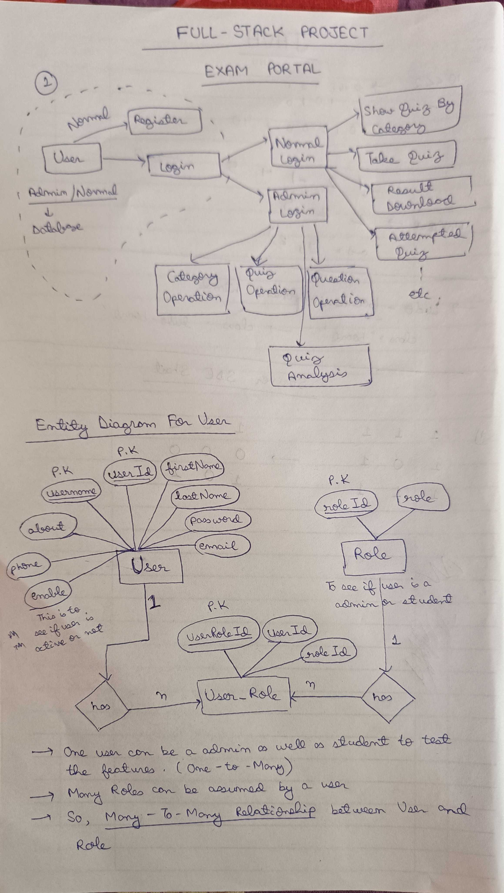
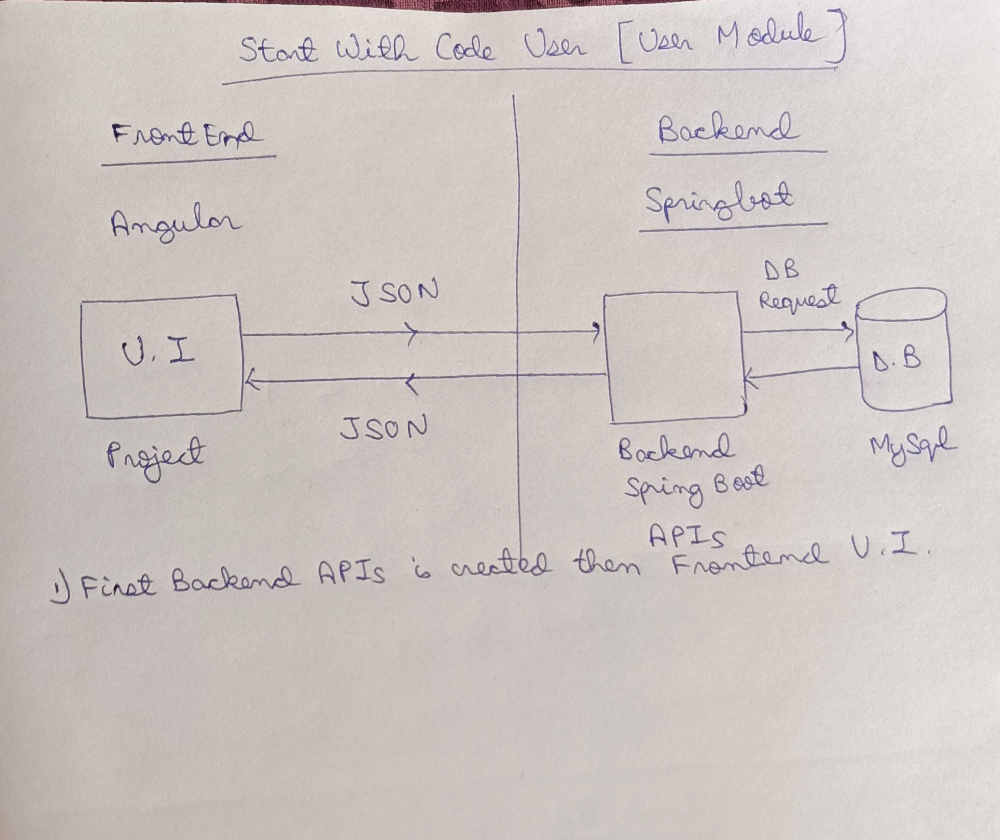

# Pariksha
Full Stack Web Application Exam Portal made using Java Spring Boot, Angular and MySQL.

Day 1:
Designing of Entity and Implementation of Backend using SpringBoot to create tables and establish Relationship between tables.

